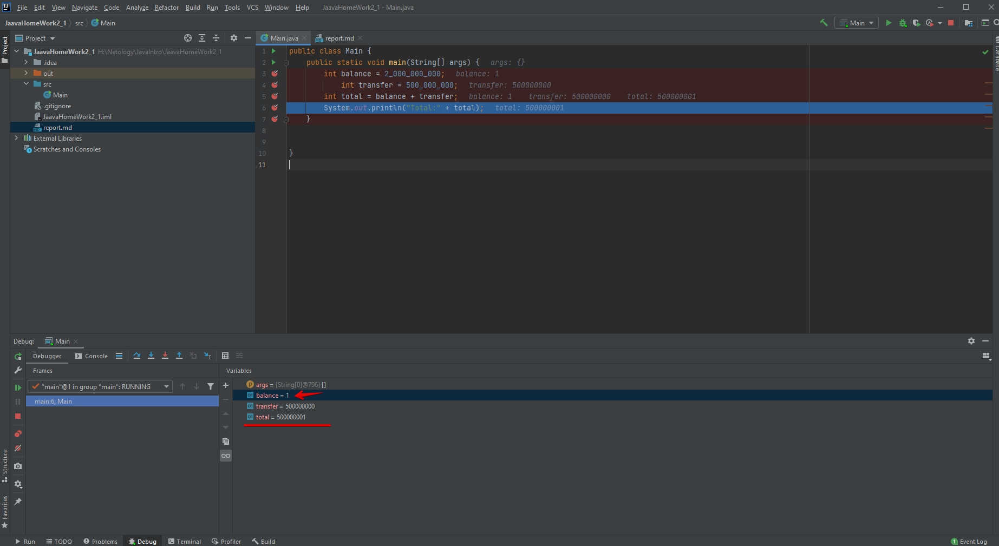
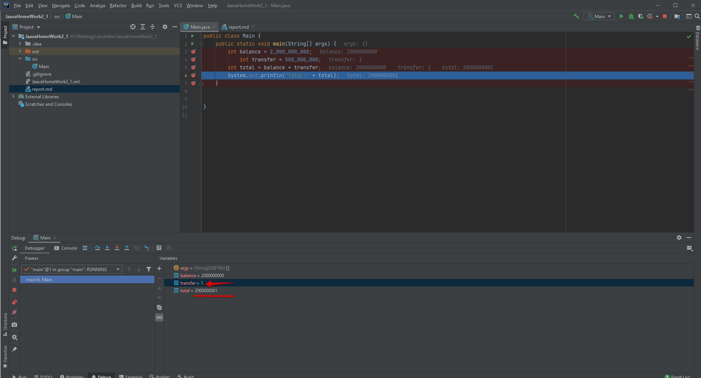

# Отчёт о тестировании приложения "Money Transfer"

## Краткое описание

05.03.2021 Создано базовое приложение ["Money Transfer"](src/Main.java) на основе входных данных:

#### Текущий баланс счёта клиента:
- переменная типа int,
- значение - 2_000_000_000 (два миллиарда рублей)

#### Сумма перевода:
- переменная типа int,
- значение - 500_000_000 (пятьсот миллионов рублей)

#### Переменная для хранения итогового значения:
- тип int
- значение вычисляется путём сложения баланса и суммы перевода - 2_500_000_000 (два миллиарда пятьсот миллионов рублей)
  

### Описание тестов

Проведены следующие тестирования:  
функциональное тестирование с анализом граничных значений

В качестве тестовых данных использовались следующие значения  
Кейс 1:  
int balance = 1;  
int transfer = 500_000_000;

Кейс 2:  
int balance = 2_000_000_000;  
int transfer = 1;

Кейс 3:  
int balance = 2_000_000_000;  
int transfer = 500_000_000;

## Результаты

1. Кейс 1 успешно
2. Кейс 2 успешно 
3. Кейс 3 провален: [Значение Total вычисляется не корректно](https://github.com/DoroshenkoDenis/JavaHomeWork2_1/issues/1)

## Общие рекомендации
Заменить тип переменной `int Total` на `long Total`
